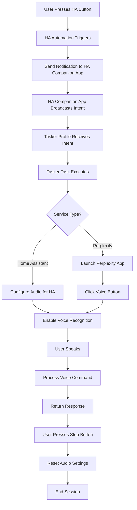

# Tesla Kecal - Car Voice Assistant Bridge

A sophisticated voice assistant integration system that bridges Home Assistant Assist and Perplexity AI through Android Tasker automation and brings it to car sound system for interaction. This project enables seamless voice control switching between smart home management and AI conversations using a single audio interface.


<div align="center">
  
[](https://www.buymeacoffee.com/mirecekdg)

</div>

## 🎥 Demo Videos

[](https://www.youtube.com/watch?v=EAhOADb4VXU)

[](https://www.youtube.com/watch?v=VlK9kio65x4)

## 🚀 What This System Does

Tesla Kecal creates a unified voice interface designed **primarily for in-car use** that allows you to:

- **Talk to Home Assistant Assist** through your car's sound system for smart home control (lights, devices, automations)
- **Talk to Perplexity AI** via car speakers for general knowledge, research, and conversations while driving
- **Switch between services** seamlessly using voice commands or dashboard controls
- **Control everything** through Home Assistant dashboard buttons accessible from your car's display or phone

The system intelligently manages audio routing between your Android device and car's sound system, enabling hands-free voice interaction with both platforms while driving. Perfect for controlling your smart home before arriving or getting AI assistance during your commute.

## 🚗 Primary Use Case: In-Car Voice Control

This system is specifically designed for **automotive use**, enabling you to:

- **Control your smart home** before arriving (turn on lights, adjust temperature, open garage)
- **Get AI assistance** while driving (weather, traffic, general questions)
- **Use your car's microphone and speakers** for natural voice interaction
- **Keep hands on the wheel** with completely voice-controlled operation
- **Access both services** through your car's Android Auto/display integration

The audio routing ensures your voice commands and responses flow through your car's sound system, providing a seamless in-vehicle experience.

## 🏗️ System Architecture

```
┌─────────────────┐     ┌──────────────────┐     ┌──────────────────┐     ┌─────────────────┐
│  Home Assistant │ --> │ HA Companion App │ --> │     Android      │ --> |   Voice Apps    │
│   (Automations) │     │   (Notifications)│     │    (Tasker)      │     │ (HA/Perplexity) │
└─────────────────┘     └──────────────────┘     └──────────────────┘     └─────────────────┘
        │                        │                        │                        │
        ▼                        ▼                        ▼                        ▼
   Input Buttons          Broadcast Intents        Intent Handling           Voice Recognition
   Boolean States         Mobile Notifications     Audio Control             App Automation
   Automations            Command Relay            UI Management             Response Processing
```

## 📋 Prerequisites

### Required Applications

1. **[Home Assistant](https://www.home-assistant.io/)** - Smart home platform
2. **[Tasker](https://tasker.joaoapps.com/)** - Android automation app
3. **[AutoVoice](https://joaoapps.com/autovoice/)** - Tasker plugin for voice control
4. **[AutoInput](https://joaoapps.com/autoinput/)** - Tasker plugin for UI automation
5. **[Perplexity](https://perplexity.ai)** - AI assistant app
6. **Home Assistant Companion App** - For Android notifications and control

### System Requirements

- Android device with Tasker support (connected to car via Bluetooth/USB)
- Home Assistant instance (local or cloud)
- Stable network connection (mobile data or car's WiFi hotspot)
- **Car with Bluetooth audio or Android Auto support**
- Car's built-in microphone and speaker system
- Optional: Car display for Home Assistant dashboard access

## 🔧 Installation Guide

### Step 1: Home Assistant Configuration

#### 1.1 Create Input Buttons

Add these input buttons to your Home Assistant configuration:

```yaml
input_button:
  ha_start:
    name: "Start Home Assistant Voice"
    icon: mdi:home-assistant
  
  ha_stop:
    name: "Stop Home Assistant Voice"
    icon: mdi:stop
  
  pp_start:
    name: "Start Perplexity Voice"
    icon: mdi:robot
  
  pp_stop:
    name: "Stop Perplexity Voice"
    icon: mdi:stop
```

#### 1.2 Create Input Boolean

Add this boolean to track voice assistant state:

```yaml
input_boolean:
  tmy_kecka:
    name: "Voice Assistant Active"
    icon: mdi:microphone
```

#### 1.3 Import Automations

Import the provided `ha-automations.yaml` file or manually create these automations:

**TASKER - ha_start**
- **Trigger**: `input_button.ha_start` state change
- **Actions**: 
  - Send broadcast intent via HA Companion app to Tasker (`ha.ha_start`)
  - Turn on `input_boolean.tmy_kecka`

**TASKER - ha_stop**
- **Trigger**: `input_button.ha_stop` state change
- **Actions**: 
  - Send broadcast intent via HA Companion app to Tasker (`ha.ha_stop`)
  - Turn off `input_boolean.tmy_kecka`

**TASKER - pp_start**
- **Trigger**: `input_button.pp_start` state change
- **Actions**: 
  - Send broadcast intent via HA Companion app to Tasker (`ha.pp_start`)
  - Turn on `input_boolean.tmy_kecka`

**TASKER - pp_stop**
- **Trigger**: `input_button.pp_stop` state change
- **Actions**: 
  - Send broadcast intent via HA Companion app to Tasker (`ha.pp_stop`)
  - Turn off `input_boolean.tmy_kecka`

### Step 2: Tasker Configuration

#### 2.1 Import Tasker Project

1. Download and import `tasker-kecalm.xml`
2. Enable the "Vlasta" project
3. Grant necessary permissions for AutoVoice and AutoInput

#### 2.2 Configure Device-Specific Settings

Update these settings in the Tasker configuration:

- **Device notification target**: Change `mobile_app_pixel_7` to your device name
- **Screen coordinates**: Adjust AutoInput click coordinates for your device resolution
- **App package names**: Verify Perplexity app package name matches your installation

## 📱 Tasker Components Breakdown

### Profiles (Intent Receivers)

| Profile Name | Intent Action | Description |
|--------------|---------------|-------------|
| `int ha.ha_start` | `ha.ha_start` | Receives Home Assistant start command |
| `int ha.ha_stop` | `ha.ha_stop` | Receives Home Assistant stop command |
| `int ha.pp_start` | `ha.pp_start` | Receives Perplexity start command |
| `int ha.pp_stop` | `ha.pp_stop` | Receives Perplexity stop command |

### Tasks (Automation Logic)

#### Voice Control Tasks

**bt.ha_start** (Task 10)
- Calls `bt.ha_start` task to initiate Home Assistant voice mode

**bt.ha_stop** (Task 3)
- Disables AutoVoice headset sound detection
- Adjusts audio settings (media volume, notification volume)
- Stops voice recognition
- Resets audio routing

**bt.pp_start** (Task 769)
- Enables media volume and AutoVoice headset detection
- Launches Perplexity app
- Waits for app to load
- Automatically clicks voice input button using AutoInput
- Configures audio routing for optimal voice recognition

**bt.pp_stop** (Task 718)
- Disables AutoVoice headset sound detection
- Resets audio settings
- Stops voice recognition
- Returns to normal audio state

#### UI Control Tasks

**bt.pp** (Task 8)
- Displays the popup scene for manual service selection

**Task 9**
- Handles Perplexity button press from popup scene

## 🎯 How to Use

### Method 1: In-Car via Home Assistant Dashboard

1. **Access HA Dashboard** in your car (via Android Auto, car display, or phone mount)
2. **Start Home Assistant Voice**:
   - Tap "Start Home Assistant Voice" button on dashboard
   - Speak your smart home commands through car's microphone
   - Responses play through car speakers
   - Tap "Stop Home Assistant Voice" when done

3. **Start Perplexity Voice**:
   - Tap "Start Perplexity Voice" button on dashboard
   - Ask questions through car's audio system
   - AI responses play through car speakers
   - Tap "Stop Perplexity Voice" when done

### Method 1a: Pre-Drive Setup

- **Before starting your car**: Set up voice assistant from your phone
- **During drive**: Use voice commands hands-free
- **Arriving home**: Control smart home devices before parking

### Method 2: Tasker Popup Scene

1. Run the `bt.pp` task in Tasker
2. Select your preferred service from the popup
3. Voice interface will automatically activate
4. Use Home Assistant buttons to stop when finished

### Method 3: Direct Tasker Tasks

- Run `bt.ha_start` for Home Assistant
- Run `bt.pp_start` for Perplexity
- Run respective stop tasks when finished

### Method 4: Android Home Screen Widget

Create a convenient home screen widget for quick access:

1. **Import Widget Creator**: Import the `bt.widget_creator.tsk.xml` file into Tasker
2. **Run Widget Creator Task**: Execute the `bt.widget_creator` task in Tasker
3. **Add Widget to Home Screen**: 
   - Long press on your Android home screen
   - Select "Widgets"
   - Find "Tasker" widgets
   - Add the "Two Button Widget" to your home screen
4. **Use Widget**: Tap either button directly from your home screen
   - **Perplexity Button**: Instantly starts Perplexity voice mode
   - **Home Assistant Button**: Instantly starts Home Assistant voice mode

The widget features:
- **Material Design**: Uses system colors and modern styling
- **Two-Button Layout**: Quick access to both voice services
- **Customizable Appearance**: Colors and corner radius can be modified
- **Direct Task Execution**: Bypasses Home Assistant dashboard for faster access

## 🔧 Technical Implementation Details

### Intent Communication Flow

The system uses a multi-step communication process:

1. **Home Assistant** triggers automations based on input button presses
2. **HA Companion App** receives notification commands from Home Assistant
3. **Broadcast Intents** are sent from the Companion app to Android system
4. **Tasker** receives these intents and executes corresponding profiles/tasks

### Audio Management

The system carefully manages Android audio routing for in-car use:

- **Car Audio Integration**: Routes voice input/output through car's sound system
- **Bluetooth Audio**: Optimized for car Bluetooth connections
- **Media Volume**: Adjusted for optimal voice recognition in vehicle environment
- **Notification Volume**: Controlled to prevent interference with driving
- **Headset Detection**: AutoVoice monitors car's audio connection as "headset"
- **Audio Focus**: Properly managed between apps and car's audio system
- **Hands-Free Operation**: Designed for safe, voice-only interaction while driving

### App Automation

**Perplexity Integration**:
- Automatic app launch
- UI automation using AutoInput
- Precise screen coordinate clicking (971,1976)
- Voice button activation

**Home Assistant Integration**:
- Native Assist integration
- Direct voice command processing
- Smart home device control

### State Management

- `input_boolean.tmy_kecka` tracks active voice session
- Prevents conflicts between services
- Provides visual feedback in Home Assistant UI
- Enables automation based on voice assistant state

## 🛠️ Customization Options

### Adjusting for Different Cars and Devices

1. **Car Audio System**: Test and adjust audio routing for your specific car model
2. **Screen Resolution**: Update AutoInput coordinates for your phone/car display
3. **Device Name**: Change notification target in Home Assistant automations
4. **App Packages**: Verify and update app package names if needed
5. **Bluetooth Settings**: Optimize for your car's Bluetooth audio profile
6. **Volume Levels**: Adjust for your car's speaker system and road noise

### Adding New Voice Services

1. Create new input buttons in Home Assistant
2. Add corresponding automations with unique intent actions
3. Create new Tasker profiles and tasks
4. Update popup scene with additional buttons

### Audio Settings Optimization

Modify these values in stop tasks for your device:
- Media volume levels
- Notification volume levels
- Audio routing preferences

## 🐛 Troubleshooting

### Common Issues

**Voice not recognized in car**:
- Check AutoVoice permissions
- Verify car's Bluetooth microphone is working
- Ensure headset detection recognizes car audio as "headset"
- Test microphone with other car apps first
- Check car's audio input settings

**Apps not launching**:
- Verify app package names
- Check AutoInput accessibility permissions
- Update screen coordinates for your device

**Home Assistant not responding**:
- Confirm Home Assistant Companion app is connected
- Check notification permissions
- Verify automation triggers are enabled

**Tasker tasks not running**:
- Enable Tasker accessibility service
- Grant all requested permissions
- Check profile activation status

### Debug Steps

1. **Test individual components**:
   - Run each Tasker task manually
   - Trigger Home Assistant automations individually
   - Verify app launches and UI automation

2. **Check logs**:
   - Home Assistant automation traces
   - Tasker run logs
   - Android system logs for permission issues

3. **Verify connectivity**:
   - Home Assistant API access
   - Network connectivity between devices
   - App-specific network permissions

## 🔄 System Workflow



## 📊 Component Summary

| Component | Count | Purpose |
|-----------|-------|---------|
| HA Automations | 4 | Bridge HA buttons to Tasker intents |
| HA Input Buttons | 4 | User interface controls |
| HA Input Boolean | 1 | State tracking |
| Tasker Profiles | 4 | Intent receivers |
| Tasker Tasks | 7 | Automation logic |
| Tasker Scenes | 1 | Alternative UI |

## 🤝 Contributing

Feel free to:
- Report issues and bugs
- Suggest improvements
- Share your customizations
- Create pull requests

## 📄 License

This project is licensed under the MIT License - see the [LICENSE](LICENSE) file for details.

## 🙏 Acknowledgments

- **Home Assistant Community** - For the amazing smart home platform
- **Tasker/AutoApps** - For powerful Android automation tools
- **Perplexity AI** - For the excellent AI assistant service

---

**Note**: This system requires careful setup and testing. Start with individual components and gradually integrate the full system. Always test voice recognition and audio routing on your specific device configuration.
