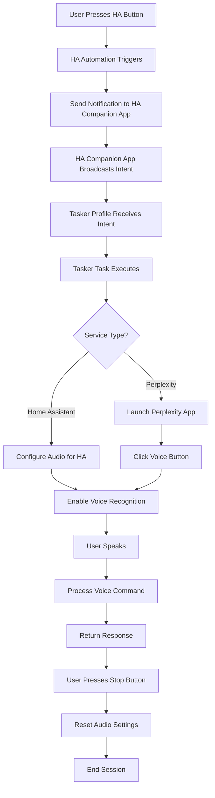

# Tesla Kecal - Voice Assistant Bridge

A sophisticated voice assistant integration system that bridges Home Assistant Assist and Perplexity AI through Android Tasker automation. This project enables seamless voice control switching between smart home management and AI conversations using a single interface.

<div align="center">
  
[](https://www.buymeacoffee.com/mirecekdg)

</div>

## 🎥 Demo Videos

[](https://www.youtube.com/watch?v=EAhOADb4VXU)

[](https://www.youtube.com/watch?v=VlK9kio65x4)

## 🚀 What This System Does

Tesla Kecal creates a unified voice interface that allows you to:

- **Talk to Home Assistant Assist** for smart home control (lights, devices, automations)
- **Talk to Perplexity AI** for general knowledge, research, and conversations
- **Switch between services** seamlessly using voice commands or a popup interface
- **Control everything** through Home Assistant dashboard buttons or Tasker scenes

The system intelligently manages audio routing, app launching, and voice recognition to provide a smooth experience across both platforms.

## 🏗️ System Architecture

```
┌─────────────────┐    ┌──────────────────┐    ┌──────────────────┐    ┌─────────────────┐
│  Home Assistant │───▶│ HA Companion App │───▶│     Android      │───▶│   Voice Apps    │
│   (Automations) │    │   (Notifications)│    │    (Tasker)      │    │ (HA/Perplexity) │
└─────────────────┘    └──────────────────┘    └──────────────────┘    └─────────────────┘
        │                        │                        │                        │
        ▼                        ▼                        ▼                        ▼
   Input Buttons          Broadcast Intents        Intent Handling           Voice Recognition
   Boolean States         Mobile Notifications     Audio Control             App Automation
   Automations            Command Relay            UI Management             Response Processing
```

## 📋 Prerequisites

### Required Applications

1. **[Home Assistant](https://www.home-assistant.io/)** - Smart home platform
2. **[Tasker](https://tasker.joaoapps.com/)** - Android automation app
3. **[AutoVoice](https://joaoapps.com/autovoice/)** - Tasker plugin for voice control
4. **[AutoInput](https://joaoapps.com/autoinput/)** - Tasker plugin for UI automation
5. **[Perplexity](https://perplexity.ai)** - AI assistant app
6. **Home Assistant Companion App** - For Android notifications and control

### System Requirements

- Android device with Tasker support
- Home Assistant instance (local or cloud)
- Stable network connection between devices
- Microphone and speaker/headphones for voice interaction

## 🔧 Installation Guide

### Step 1: Home Assistant Configuration

#### 1.1 Create Input Buttons

Add these input buttons to your Home Assistant configuration:

```yaml
input_button:
  ha_start:
    name: "Start Home Assistant Voice"
    icon: mdi:home-assistant
  
  ha_stop:
    name: "Stop Home Assistant Voice"
    icon: mdi:stop
  
  pp_start:
    name: "Start Perplexity Voice"
    icon: mdi:robot
  
  pp_stop:
    name: "Stop Perplexity Voice"
    icon: mdi:stop
```

#### 1.2 Create Input Boolean

Add this boolean to track voice assistant state:

```yaml
input_boolean:
  tmy_kecka:
    name: "Voice Assistant Active"
    icon: mdi:microphone
```

#### 1.3 Import Automations

Import the provided `ha-automations.yaml` file or manually create these automations:

**TASKER - ha_start**
- **Trigger**: `input_button.ha_start` state change
- **Actions**: 
  - Send broadcast intent via HA Companion app to Tasker (`ha.ha_start`)
  - Turn on `input_boolean.tmy_kecka`

**TASKER - ha_stop**
- **Trigger**: `input_button.ha_stop` state change
- **Actions**: 
  - Send broadcast intent via HA Companion app to Tasker (`ha.ha_stop`)
  - Turn off `input_boolean.tmy_kecka`

**TASKER - pp_start**
- **Trigger**: `input_button.pp_start` state change
- **Actions**: 
  - Send broadcast intent via HA Companion app to Tasker (`ha.pp_start`)
  - Turn on `input_boolean.tmy_kecka`

**TASKER - pp_stop**
- **Trigger**: `input_button.pp_stop` state change
- **Actions**: 
  - Send broadcast intent via HA Companion app to Tasker (`ha.pp_stop`)
  - Turn off `input_boolean.tmy_kecka`

### Step 2: Tasker Configuration

#### 2.1 Import Tasker Project

1. Download and import `tasker-kecalm.xml`
2. Enable the "Vlasta" project
3. Grant necessary permissions for AutoVoice and AutoInput

#### 2.2 Configure Device-Specific Settings

Update these settings in the Tasker configuration:

- **Device notification target**: Change `mobile_app_pixel_7` to your device name
- **Screen coordinates**: Adjust AutoInput click coordinates for your device resolution
- **App package names**: Verify Perplexity app package name matches your installation

## 📱 Tasker Components Breakdown

### Profiles (Intent Receivers)

| Profile Name | Intent Action | Description |
|--------------|---------------|-------------|
| `int ha.ha_start` | `ha.ha_start` | Receives Home Assistant start command |
| `int ha.ha_stop` | `ha.ha_stop` | Receives Home Assistant stop command |
| `int ha.pp_start` | `ha.pp_start` | Receives Perplexity start command |
| `int ha.pp_stop` | `ha.pp_stop` | Receives Perplexity stop command |

### Tasks (Automation Logic)

#### Voice Control Tasks

**bt.ha_start** (Task 10)
- Calls `bt.ha_start` task to initiate Home Assistant voice mode

**bt.ha_stop** (Task 3)
- Disables AutoVoice headset sound detection
- Adjusts audio settings (media volume, notification volume)
- Stops voice recognition
- Resets audio routing

**bt.pp_start** (Task 769)
- Enables media volume and AutoVoice headset detection
- Launches Perplexity app
- Waits for app to load
- Automatically clicks voice input button using AutoInput
- Configures audio routing for optimal voice recognition

**bt.pp_stop** (Task 718)
- Disables AutoVoice headset sound detection
- Resets audio settings
- Stops voice recognition
- Returns to normal audio state

#### UI Control Tasks

**bt.pp** (Task 8)
- Displays the popup scene for manual service selection

**Task 9**
- Handles Perplexity button press from popup scene

### Scene (User Interface)

**Popup Scene**
- **Title**: "Kdo bude kecat" (Who will talk)
- **Perplexity Button**: Launches Perplexity voice mode
- **Home Assistant Button**: Launches Home Assistant voice mode
- **Dimensions**: 675x562 pixels (portrait)
- **Background**: Blue theme (#FF004D8C)

## 🎯 How to Use

### Method 1: Home Assistant Dashboard

1. **Start Home Assistant Voice**:
   - Press "Start Home Assistant Voice" button
   - Speak your smart home commands
   - Press "Stop Home Assistant Voice" when done

2. **Start Perplexity Voice**:
   - Press "Start Perplexity Voice" button
   - Ask questions or have conversations
   - Press "Stop Perplexity Voice" when done

### Method 2: Tasker Popup Scene

1. Run the `bt.pp` task in Tasker
2. Select your preferred service from the popup
3. Voice interface will automatically activate
4. Use Home Assistant buttons to stop when finished

### Method 3: Direct Tasker Tasks

- Run `bt.ha_start` for Home Assistant
- Run `bt.pp_start` for Perplexity
- Run respective stop tasks when finished

## 🔧 Technical Implementation Details

### Intent Communication Flow

The system uses a multi-step communication process:

1. **Home Assistant** triggers automations based on input button presses
2. **HA Companion App** receives notification commands from Home Assistant
3. **Broadcast Intents** are sent from the Companion app to Android system
4. **Tasker** receives these intents and executes corresponding profiles/tasks

### Audio Management

The system carefully manages Android audio routing:

- **Media Volume**: Adjusted for optimal voice recognition
- **Notification Volume**: Controlled to prevent interference
- **Headset Detection**: AutoVoice monitors for voice input
- **Audio Focus**: Properly managed between apps

### App Automation

**Perplexity Integration**:
- Automatic app launch
- UI automation using AutoInput
- Precise screen coordinate clicking (971,1976)
- Voice button activation

**Home Assistant Integration**:
- Native Assist integration
- Direct voice command processing
- Smart home device control

### State Management

- `input_boolean.tmy_kecka` tracks active voice session
- Prevents conflicts between services
- Provides visual feedback in Home Assistant UI
- Enables automation based on voice assistant state

## 🛠️ Customization Options

### Adjusting for Different Devices

1. **Screen Resolution**: Update AutoInput coordinates in `bt.pp_start`
2. **Device Name**: Change notification target in Home Assistant automations
3. **App Packages**: Verify and update app package names if needed

### Adding New Voice Services

1. Create new input buttons in Home Assistant
2. Add corresponding automations with unique intent actions
3. Create new Tasker profiles and tasks
4. Update popup scene with additional buttons

### Audio Settings Optimization

Modify these values in stop tasks for your device:
- Media volume levels
- Notification volume levels
- Audio routing preferences

## 🐛 Troubleshooting

### Common Issues

**Voice not recognized**:
- Check AutoVoice permissions
- Verify microphone access for apps
- Ensure headset detection is properly configured

**Apps not launching**:
- Verify app package names
- Check AutoInput accessibility permissions
- Update screen coordinates for your device

**Home Assistant not responding**:
- Confirm Home Assistant Companion app is connected
- Check notification permissions
- Verify automation triggers are enabled

**Tasker tasks not running**:
- Enable Tasker accessibility service
- Grant all requested permissions
- Check profile activation status

### Debug Steps

1. **Test individual components**:
   - Run each Tasker task manually
   - Trigger Home Assistant automations individually
   - Verify app launches and UI automation

2. **Check logs**:
   - Home Assistant automation traces
   - Tasker run logs
   - Android system logs for permission issues

3. **Verify connectivity**:
   - Home Assistant API access
   - Network connectivity between devices
   - App-specific network permissions

## 🔄 System Workflow



## 📊 Component Summary

| Component | Count | Purpose |
|-----------|-------|---------|
| HA Automations | 4 | Bridge HA buttons to Tasker intents |
| HA Input Buttons | 4 | User interface controls |
| HA Input Boolean | 1 | State tracking |
| Tasker Profiles | 4 | Intent receivers |
| Tasker Tasks | 7 | Automation logic |
| Tasker Scenes | 1 | Alternative UI |

## 🤝 Contributing

Feel free to:
- Report issues and bugs
- Suggest improvements
- Share your customizations
- Create pull requests

## 📄 License

This project is licensed under the MIT License - see the [LICENSE](LICENSE) file for details.

## 🙏 Acknowledgments

- **Home Assistant Community** - For the amazing smart home platform
- **Tasker/AutoApps** - For powerful Android automation tools
- **Perplexity AI** - For the excellent AI assistant service

---

**Note**: This system requires careful setup and testing. Start with individual components and gradually integrate the full system. Always test voice recognition and audio routing on your specific device configuration.
